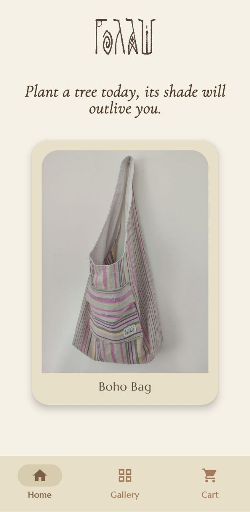

# Golash 🛒 

**Modern Android Shopping App**  
_A full-featured e-commerce app in active development, built with Jetpack Compose, Hilt, and clean architecture._

---

## 🚀 Overview
Golash is the official Android app for the Golash clothing brand, built for production use.  
It’s designed to provide customers with a seamless shopping experience — featuring elegant UI, responsive animations, and a robust, scalable architecture for long-term growth.

---

## ✨ Features

- **Jetpack Compose UI** – Fully declarative UI with custom components and animations
- **MVVM + Clean Architecture** – Structured, maintainable, and scalable codebase
- **Hilt Dependency Injection** – Modular, testable, and reusable components
- **Coroutines & StateFlow** – Reactive state handling and async operations
- **Custom UI/UX**:
  - Animated product galleries and transitions
  - Curved text and advanced gesture handling
  - Label-style price tags with cut-out corners
  - Interactive add-to-cart animations
- **Room Database** – Local persistence for cart and offline access
- **Material 3 Design** – Modern, accessible, and visually appealing
- **Moshi** – JSON parsing
- **Repository Pattern** – Clear separation of data sources

**Planned Features:**
- Firebase integration for authentication, storage, and analytics
- Unit and UI testing coverage

---

## 📸 Screenshots




---

## 🛠️ Tech Stack
- **Language:** Kotlin  
- **UI:** Jetpack Compose, Material 3  
- **Architecture:** MVVM + Clean Architecture  
- **DI:** Hilt  
- **Async:** Coroutines & Flow  
- **Database:** Room  
- **JSON Parsing:** Moshi  

---

## 📝 Status
> **This project is a work in progress (WIP).**  
> Actively developing new features, improving UI/UX, and adding tests/documentation.

---

## 💡 Why Golash?
- Demonstrates advanced Compose UI and animation techniques
- Showcases best practices for scalable Android apps
- Highlights skills in architecture, DI, and modern Android tooling
- Built with portfolio and production readiness in mind

---

## 🚦 How to Run
1. **Clone the repo**  
   ```bash
   git clone https://github.com/yourusername/golash.git
2. **Open in Android Studio (Giraffe or newer)**
3. **Build & Run** on an emulator or device (API 26+)

---

## 📄 License

This project is dual-licensed:

- **Non-Commercial License (default)** – You may view, study, and fork this repository for personal learning or portfolio purposes. Commercial use is **not allowed**.  
- **Commercial License** – A separate license is available for commercial use. To obtain one, contact: [your email or website].  

Full details are in the [LICENSE.txt](LICENSE.txt) file.
---

## 👋 About Me

Hi, I’m Nemanja, a passionate Android developer specializing in modern, beautiful, and robust mobile apps.  
_Contact: budimkic@proton.me_

---

## ⭐️ Like what you see?

Feel free to reach out for collaboration or freelance opportunities!
