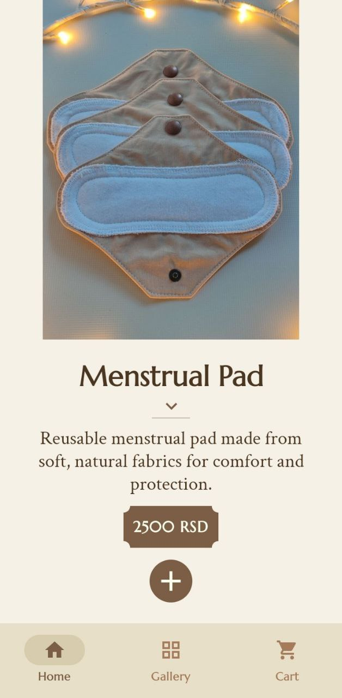
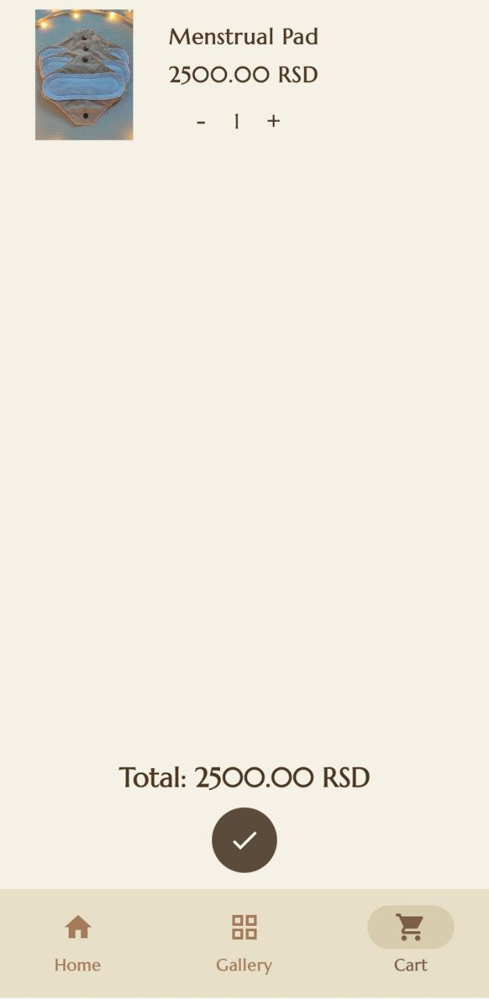

# Golash 🛒 

**Modern Android Shopping App**  
_A full-featured e-commerce app in active development, built with Jetpack Compose, Hilt, and clean architecture._

---

## 🚀 Overview
Golash is the official Android app for the Golash clothing brand, built for production.  
It provides a seamless shopping experience with elegant UI, smooth animations, and a scalable architecture for long-term growth.

---

## ✨ Features

- **Jetpack Compose UI** – Declarative UI with custom components & animations
- **MVVM + Clean Architecture** – Structured, maintainable, scalable codebase
- **Hilt DI** – Modular, testable, reusable components
- **Coroutines & StateFlow** – Reactive state & async operations
- **Custom UI/UX**:
    - Animated product galleries and transitions
    - Curved text & advanced gestures
    - Label-style price tags with cut-out corners
    - Interactive add-to-cart animations
- **Room Database** – Local cart persistence & offline support
- **Material 3 Design** – Modern, accessible, visually appealing
- **Moshi** – JSON parsing
- **Repository Pattern** – Clear separation of data sources

**Planned Features:** Firebase (auth, storage, analytics) and full test coverage

---

## 📸 Screenshots

<p float="left">
  
  
  
</p>

---

## 🛠️ Tech Stack

- **Language:** Kotlin  
- **UI:** Jetpack Compose, Material 3  
- **Architecture:** MVVM + Clean Architecture  
- **DI:** Hilt  
- **Async:** Coroutines & Flow  
- **Database:** Room  
- **JSON Parsing:** Moshi  

---

## 📝 Status

**Work in progress (WIP)** – actively developing features, improving UI/UX, and adding tests/documentation.

---

## 💡 Why Golash?

- Explore advanced Jetpack Compose UI and animations in a real app
- Learn scalable architecture, DI, and reactive state handling
- See a production-ready e-commerce app from start to finish
- Great reference for building robust, modern Android apps

---

## 🚦 How to Run

1. **Clone the repo**
   ```bash
   git clone https://github.com/yourusername/golash.git
   ```
2. **Open in Android Studio (Giraffe or newer)**
3. **Build & Run on an emulator or device (API 26+)**

---

## 📄 License

This project is dual-licensed:

- **Non-Commercial License (default)** – You may view, study, and fork this repository for personal learning or portfolio purposes. Commercial use is **not allowed**.  
- **Commercial License** – A separate license is available for commercial use. To obtain one, contact: [your email or website].  

Full details are in the [LICENSE.txt](LICENSE.txt) file.
---

## 👋 About Me

Hi, I’m Nemanja — building elegant and robust Android apps for real-world use.
_Contact: budimkic@proton.me_

---

## ⭐️ Like what you see?

Feel free to reach out for collaboration or freelance opportunities!
